# DevSecOps CI/CD Pipeline Laboratory

## Descripción del proyecto

Este repositorio contiene la implementación de un laboratorio de **DevSecOps**, cuyo objetivo es demostrar la integración de prácticas de **Integración Continua (CI)**, **Entrega Continua (CD)**, **seguridad del software** y **monitoreo** dentro del ciclo de vida de desarrollo de una aplicación web.

El laboratorio implementa un pipeline completo que permite:

- Construir una aplicación web basada en **Django**
- Ejecutar integración continua con **GitHub Actions**
- Realizar despliegue continuo con **Jenkins**
- Detectar vulnerabilidades de dependencias con **Snyk**
- Desplegar la aplicación en **Kubernetes**
- Monitorear la aplicación con **Prometheus**
- Visualizar métricas con **Grafana**

Este enfoque permite mejorar la **seguridad, automatización y eficiencia operativa** del proceso de desarrollo de software.

---

# Enlace al repositorio

Repositorio del proyecto:

https://github.com/milo1409/devsecops-lab

---

# Arquitectura del laboratorio

Flujo general del pipeline DevSecOps:

GitHub Repository
│
GitHub Actions (CI)
│
Security Scan (Snyk)
│
Docker Build
│
Jenkins Pipeline (CD)
│
Kubernetes Deployment
│
Prometheus Monitoring
│
Grafana Dashboards

---

# Tecnologías utilizadas

| Herramienta | Propósito |
|-------------|-----------|
| GitHub | Gestión del código fuente |
| GitHub Actions | Integración Continua |
| Jenkins | Entrega Continua |
| Docker | Contenerización |
| Kubernetes (k3s) | Orquestación |
| Snyk | Análisis de seguridad |
| Prometheus | Recolección de métricas |
| Grafana | Visualización de métricas |
| Django | Framework web |

---

# Pipeline CI/CD

## Integración Continua (GitHub Actions)

La integración continua se ejecuta automáticamente cuando se realiza un **push al repositorio**.

El pipeline ejecuta las siguientes tareas:

1. Clonar el repositorio
2. Instalar dependencias
3. Ejecutar análisis de seguridad con Snyk
4. Construir imagen Docker
5. Publicar la imagen en el registry

Archivo de configuración: .github/workflows/ci.yml

### Evidencia pipeline CI

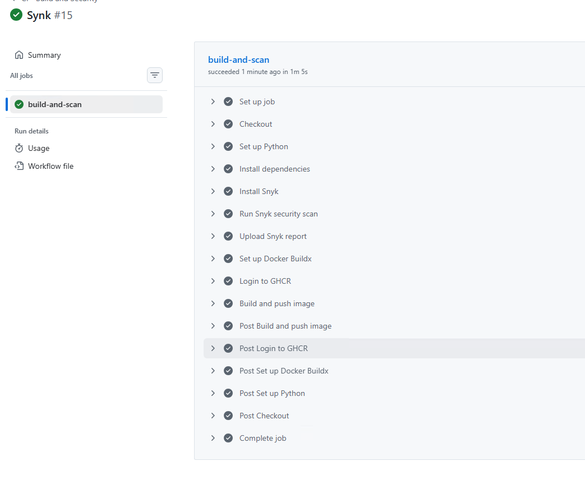

---

## Entrega Continua (Jenkins)

El despliegue continuo se realiza utilizando **Jenkins**, que ejecuta el pipeline definido en: jenkins/Jenkinsfile

El pipeline realiza:

1. Clonación del repositorio
2. Construcción de la imagen Docker
3. Despliegue en Kubernetes
4. Exposición del servicio

### Evidencia pipeline CD

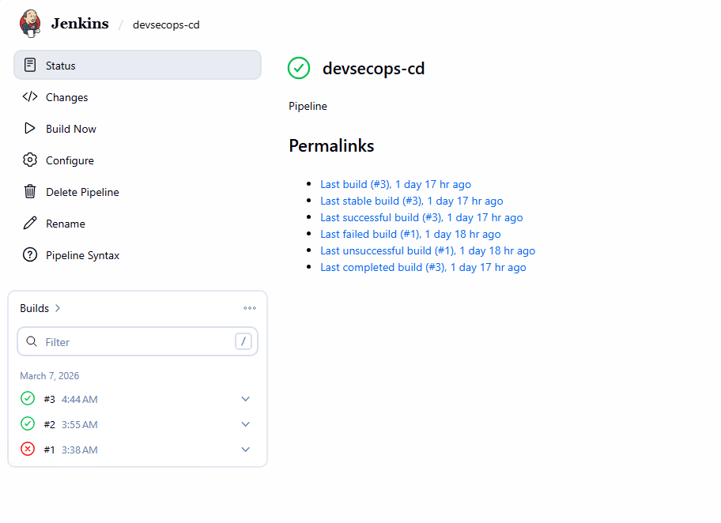
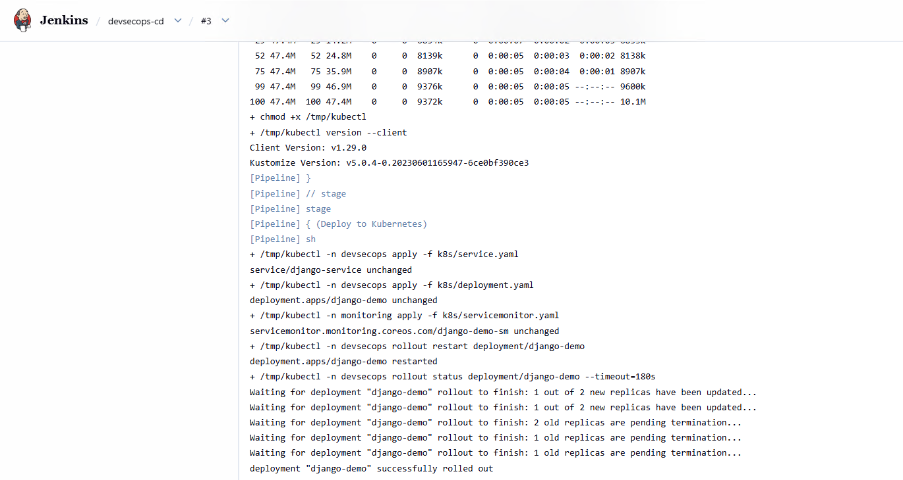

---

# Despliegue en Kubernetes

La aplicación se despliega en Kubernetes utilizando los archivos ubicados en: k8s/

Archivos principales:

deployment.yaml
service.yaml
namespace.yaml
ingress.yaml
servicemonitor.yaml

### Evidencia configuración Kubernetes

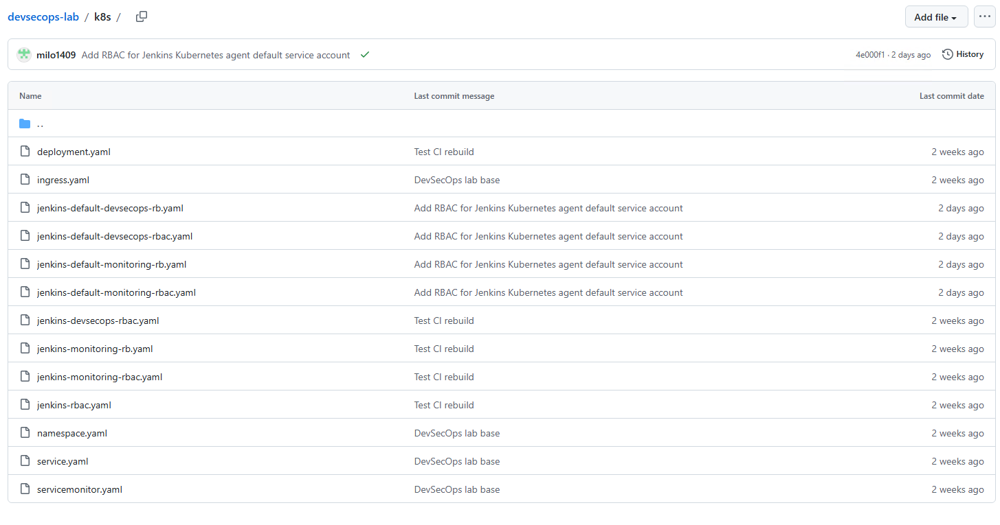

---

# Seguridad del software

Para integrar prácticas DevSecOps se utilizó **Snyk**, que analiza vulnerabilidades en las dependencias del proyecto.

El análisis se realiza sobre: app/requirements.txt

Snyk detecta vulnerabilidades como:

- SQL Injection
- Denial of Service
- Resource Exhaustion
- Command Injection
- HTTP Request Smuggling

### Evidencia análisis de seguridad

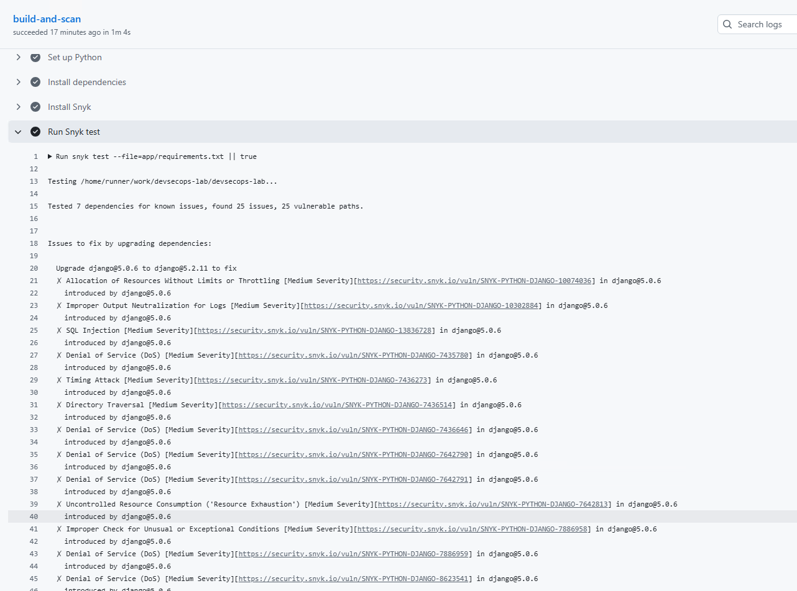

### Recomendación de mejoras

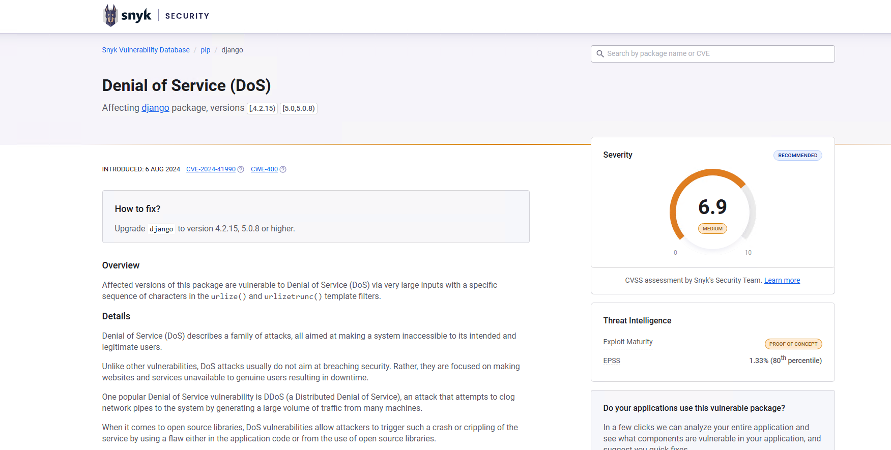

---

# Monitoreo del sistema

El monitoreo se implementó utilizando:

- **Prometheus**
- **Grafana**

Prometheus recolecta métricas de:

- CPU
- Memoria
- Pods
- Servicios
- Estado del clúster

---

# Monitoreo con Prometheus

Para la observabilidad del sistema se implementó **Prometheus**, encargado de recolectar métricas del clúster Kubernetes y de la aplicación desplegada.

Prometheus permite:

- Recolectar métricas de los pods
- Monitorear servicios de Kubernetes
- Generar reglas de alerta
- Exponer métricas para Grafana

---

## Estado de reglas de alerta

Prometheus permite configurar reglas de alerta que detectan fallos o comportamientos anómalos en los servicios del clúster.

Entre las alertas configuradas se encuentran:

- AlertmanagerFailedReload
- AlertmanagerMembersInconsistent
- AlertmanagerFailedToSendAlerts
- AlertmanagerClusterFailedToSendAlerts
- AlertmanagerConfigInconsistent
- AlertmanagerClusterDown
- AlertmanagerClusterCrashLooping
- etcdMembersDown

Estas reglas permiten detectar problemas de:

- disponibilidad
- sincronización del clúster
- errores en configuración
- fallos de envío de alertas

### Evidencia de reglas en Prometheus

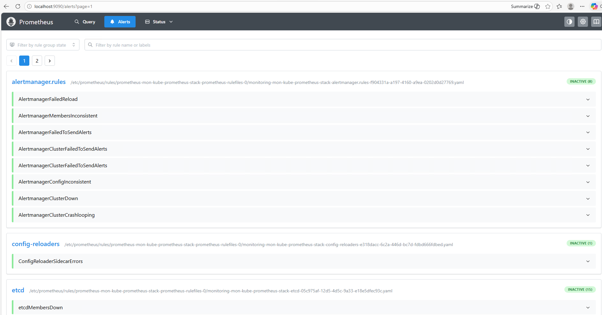

---

## Targets monitoreados por Prometheus

Prometheus utiliza el mecanismo de **scraping** para recolectar métricas de diferentes servicios.

En este laboratorio se monitorean los siguientes servicios:

- Aplicación Django desplegada en Kubernetes
- Grafana
- Alertmanager
- Prometheus stack components

Cada servicio expone métricas mediante el endpoint: /metrics

Prometheus consulta periódicamente estos endpoints para recolectar métricas.

### Evidencia de targets activos

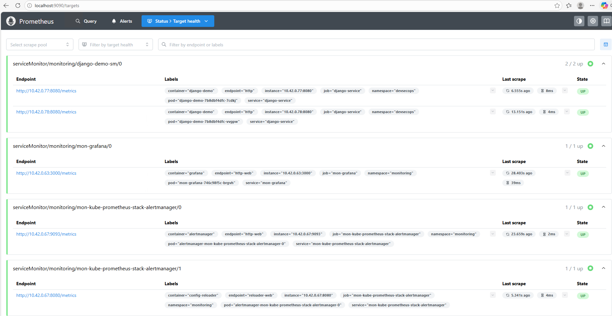

En la evidencia se puede observar que los targets se encuentran en estado **UP**, lo que indica que Prometheus está recolectando correctamente las métricas del sistema.

# Dashboards de Grafana

Grafana permite visualizar métricas del clúster Kubernetes y del sistema.

### Dashboard principal

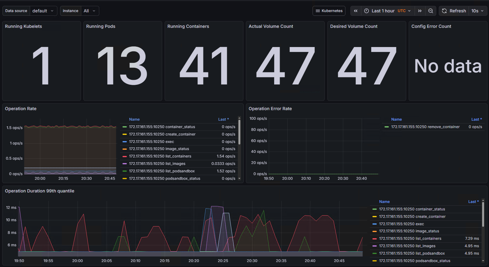

---

### Uso de CPU y recursos

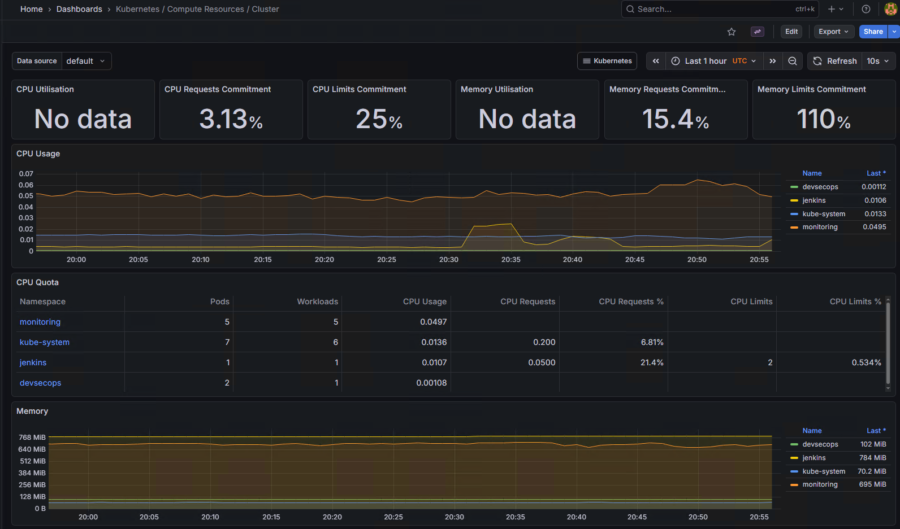

---

### Monitoreo de pods

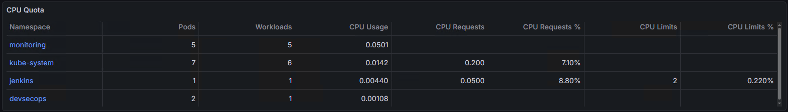

---

# Flujo completo del laboratorio

1. El desarrollador realiza cambios en el código.
2. Se realiza un **push al repositorio GitHub**.
3. GitHub Actions ejecuta el pipeline de **CI**.
4. Se ejecuta el análisis de seguridad con **Snyk**.
5. Se construye la imagen Docker.
6. Jenkins ejecuta el pipeline de **CD**.
7. La aplicación se despliega en Kubernetes.
8. Prometheus recolecta métricas del sistema.
9. Grafana muestra dashboards de monitoreo.

---

# Evidencias del laboratorio

Las evidencias del laboratorio se encuentran en: /evidencias

Incluyen:

- Pipeline CI ejecutándose
- Pipeline CD ejecutándose
- Dashboards de Grafana
- Informe de seguridad con Snyk
- Configuración de Kubernetes

---

# Reflexión sobre eficiencia operativa

La implementación de prácticas DevSecOps permite mejorar significativamente la eficiencia operativa del proceso de desarrollo.

Entre los principales beneficios se encuentran:

- Automatización de integración y despliegue
- Identificación temprana de vulnerabilidades
- Monitoreo continuo del sistema
- Reducción de errores manuales
- Mayor confiabilidad en los despliegues

La integración de **CI/CD, seguridad automatizada y monitoreo** permite construir sistemas más seguros, observables y escalables.

---

# Conclusión

Este laboratorio demuestra cómo implementar un pipeline DevSecOps completo integrando automatización, seguridad y monitoreo.

La solución permite mejorar la calidad del software, detectar vulnerabilidades tempranamente y monitorear el comportamiento del sistema en producción.